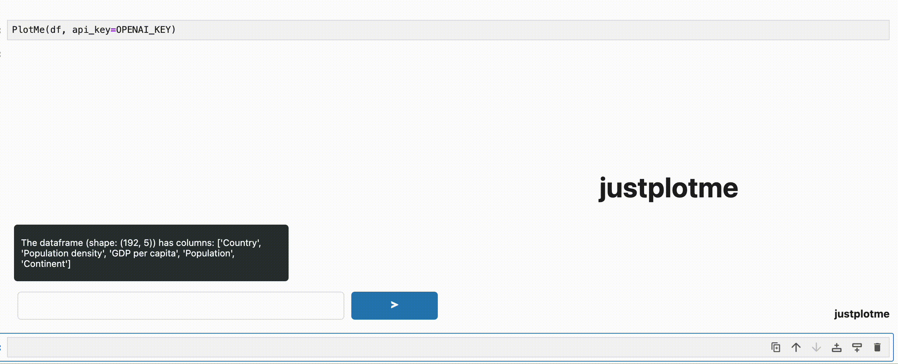

# justplotme

justplotme is a library that uses LLMs to perform the AGI level task of creating plots.



## Installation

```sh
pip install justplotme
```

## Usage
Open `example.ipynb` in JupyterLab / Notebook. You'll need an [openai api key](https://platform.openai.com/api-keys) (only llm currently supported) to use the widget. Export it to an env variable called `OPENAI_API_KEY`. **DO NOT** actually put the key in the notebook, you might end up leaking it. In the notebook, you can use `justplotme` as follows:

```python
import os
from justplotme import PlotMe

OPENAI_KEY = os.getenv("OPENAI_API_KEY")

# df is a pandas DataFrame
PlotMe(df, api_key=OPENAI_KEY)

```

## Development installation

Create a virtual environment and and install justplotme in *editable* mode with the
optional development dependencies:

```sh
python3 -m venv .venv
source .venv/bin/activate
pip install -e ".[dev]"
```

Changes made in `src/justplotme/static/` will be reflected
in the notebook.


## To Do
- [x] V0 that works on the browser
- [ ] Release on pypi
- [ ] Make logging work, less painful
- [ ] Make justplotme work in VSCode jupyter notebooks
- [ ] Support more LLMs
- [ ] Support multiline statements, not just expressions
- [ ] Add support to different plotting backends
- [ ] More data exploration modalities? Maps maybe?